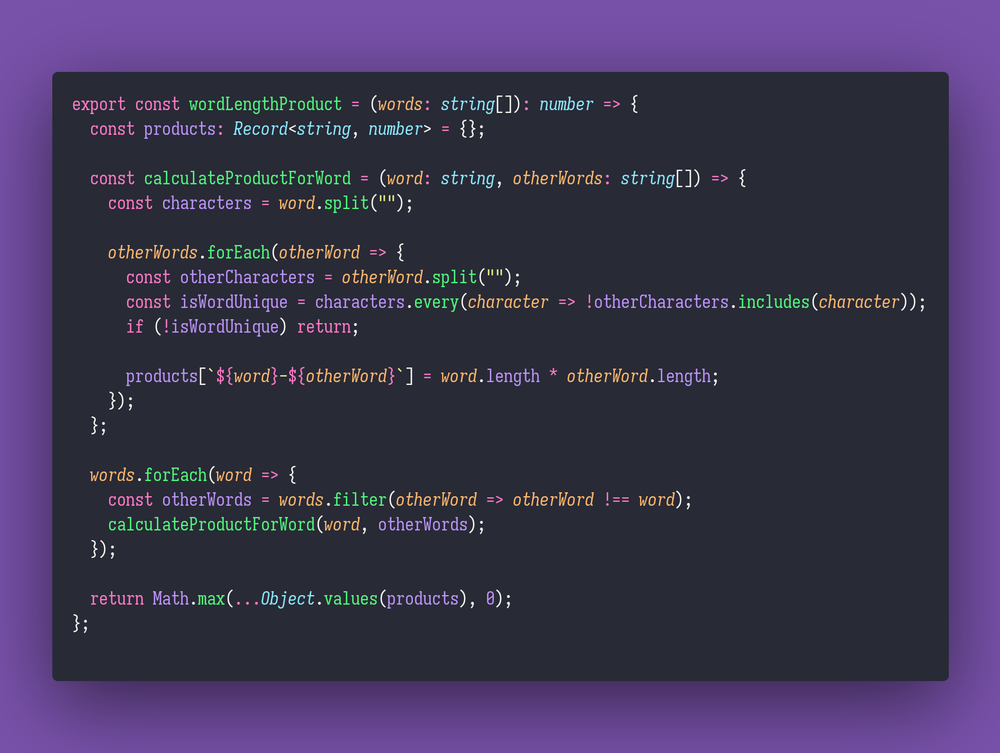

# 🪇 Word Length Product

Interview question of the [issue #340 of rendezvous with cassidoo](https://buttondown.email/cassidoo/archive/dont-let-doubt-stop-you-from-getting-where-you/).

## The Question

Given a string array, find the maximum product of word lengths where the words don't share any
letters.

### Example

```js
> wordLengthProduct(["fish","fear","boo","egg","cake","abcdef"])
> 16 // "fish" and "cake"

> wordLengthProduct(["a","aa","aaa","aaaa"])
> 0 // all of them share "a"
```

## Solution


