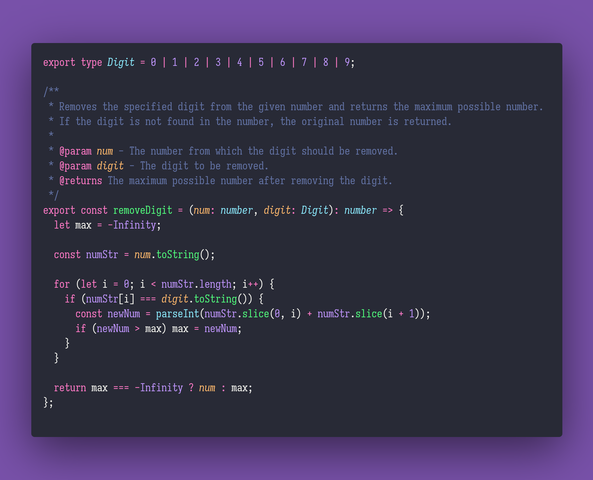

# 📠 Remove Digit

Interview question of the [issue #341 of rendezvous with cassidoo](https://buttondown.email/cassidoo/archive/the-potential-for-greatness-lives-within-each-of/).

## The Question

Given a number and a digit to remove from that number, maximize the resulting number after the
digit has been removed and print it. You can choose how you want to handle a digit not existing in
the number.

### Example

```js
> removeDigit(31415926, 1)
> 3415926 // we picked the second 1 in the number.

> removeDigit(1231, 1)
> 231 // 231 > 123
```

## Solution


