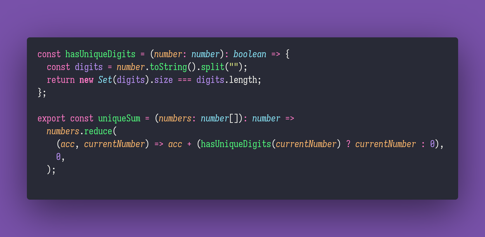

# 👑 Unique Sum

Interview question of the [issue #346 of rendezvous with cassidoo](https://buttondown.email/cassidoo/archive/all-we-have-to-decide-is-what-to-do-with-the-time-1254/).

## The Question

Given an array of numbers, add all of the values together but only if the number doesn't repeat a
digit.

### Example

```js
> uniqueSum([1,2,3])
> 6

> uniqueSum([11,22,33])
> 0

> uniqueSum([101,2,3])
> 5
```

## Solution


