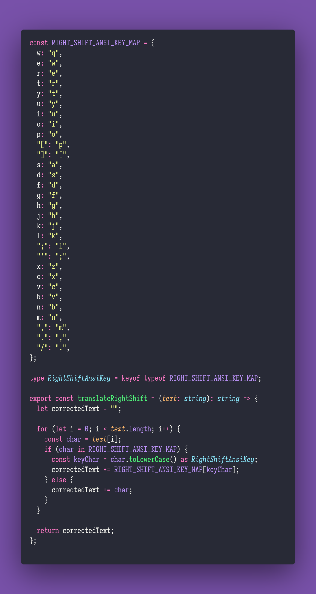

# 🪣 Translate Right Shift

Interview question of the [issue #350 of rendezvous with cassidoo](https://buttondown.email/cassidoo/subscribers/fc81c7a7-33f0-4542-b71e-51d2d8cf909c/archive/sometimes-it-takes-a-long-time-to-sound-like).

## The Question

Imagine the users on your app are all typing slightly incorrectly, in that they shifted their
hands one key to the right. Write a function that translates what they mean to say. The examples
below assume an ANSI keyboard layout, you can choose how you want to do

The examples below assume an ANSI keyboard layout, you can choose how you want to do that!

### Example

```js
> translateRightShift(';p; epeor')
"lol wowie"

> translateRightShift('ejp s, o')
"who am i"
```

## Solution


