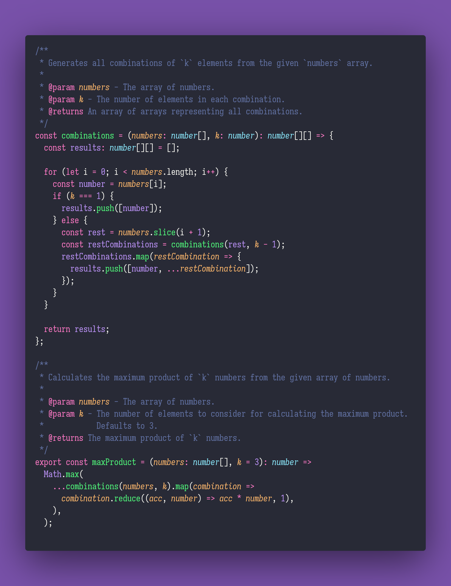

# ⛲️ Max Product

Interview question of the [issue #352 of rendezvous with cassidoo](https://buttondown.email/cassidoo/archive/an-honest-man-is-always-a-child-socrates/).

## The Question

Write a function that takes in a list (of length >= 3) of numbers, and returns the maximum product
that can be obtained by multiplying any three integers from the list.

### Example

```js
> maxProduct([2, 4, 1, 3, -5, 6])
> 72 // 4*3*6
```

## Solution


