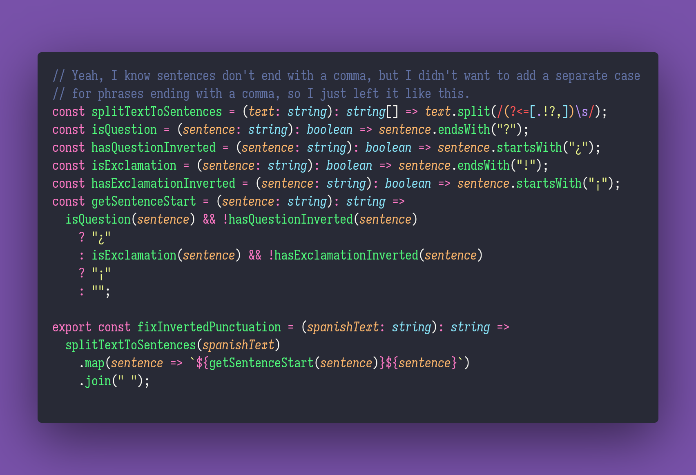

# 🇪🇸 Fix Inverted Punctuation

Interview question of the [issue #353 of rendezvous with cassidoo](https://buttondown.email/cassidoo/archive/a-thousand-moments-that-i-had-just-taken-for/).

## The Question

The Spanish language uses inverted punctuation marks (¿ and ¡) in interrogative and exclamatory
sentences. Write a function that takes in a string str, and adds ¿ and ¡ if they're needed. You can
ignore exclamations in the middle of a sentence for this problem.

### Example

```js
> fixInvertedPunctuation("Feliz cumpleaños!")
> "¡Feliz cumpleaños!"

> fixInvertedPunctuation("Ella ya se graduó de la universidad? ¡No!")
> "¿Ella ya se graduó de la universidad? ¡No!"
```

## Solution


