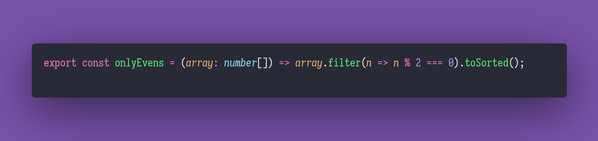

# 🌈 Only Evens

Interview question of the [issue #355 of rendezvous with cassidoo](https://buttondown.email/cassidoo/archive/the-cure-to-boredom-is-curiosity-there-is-no-cure/).

## The Question

Write a function that takes an array of integers and returns a new array containing only the even
numbers, and sorted.

### Example

```js
> onlyEvens([1, 2, 3, 4, 5, 2])
> [2, 2, 4]

> onlyEvens([7, 8, 1, 0, 2, 5])
> [0, 2, 8]

> onlyEvens([11, 13, 15])
> []
```

## Solution


