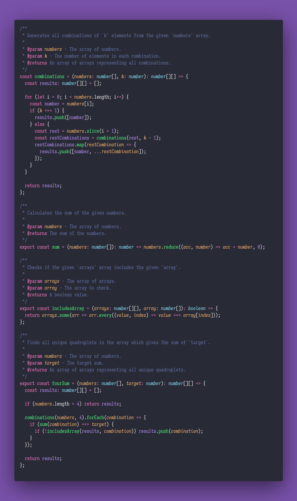

# 🚜 Four Sums

Interview question of the [issue #356 of rendezvous with cassidoo](https://buttondown.email/cassidoo/archive/until-youre-ready-to-look-foolish-youll-never/).

## The Question

Write a function that takes an array of integers and a target sum, and returns all
unique quadruplets `[a, b, c, d]` in the array such that `a + b + c + d = target`.
If it's impossible, return an empty

### Example

```js
> fourSum([1, 0, -1, 0, -2, 2], 0)
> [[-2, -1, 1, 2], [-2, 0, 0, 2], [-1, 0, 0, 1]]

> fourSum([], 0)
> []

> fourSum([1, -2, -5, -4, -3, 3, 3, 5], -11)
> [[-5, -4, -3, 1]]
```

## Solution


