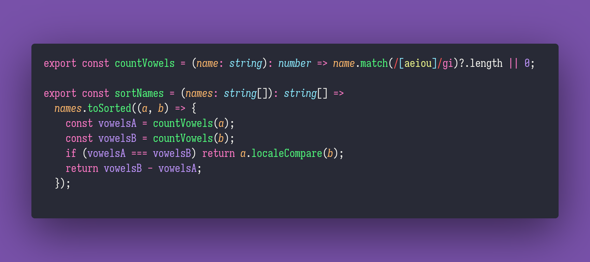

# 🚘 Sort Names

Interview question of the [issue #356 of rendezvous with cassidoo](https://buttondown.email/cassidoo/archive/life-is-trying-things-to-see-if-they-work-ray/).

## The Question

Write a function that takes a list of names and returns the names sorted by the number of vowels in
each name in descending order.

If two names have the same number of vowels, sort them alphabetically.

### Example

```js
> sortNames(["Goku", "Vegeta", "Piccolo", "Gohan"])
> ["Piccolo", "Vegeta", "Gohan", "Goku"]

> sortNames(["Edward", "Alphonse", "Roy", "Winry"])
> ["Alphonse", "Edward", "Roy", "Winry"]
```

## Solution


