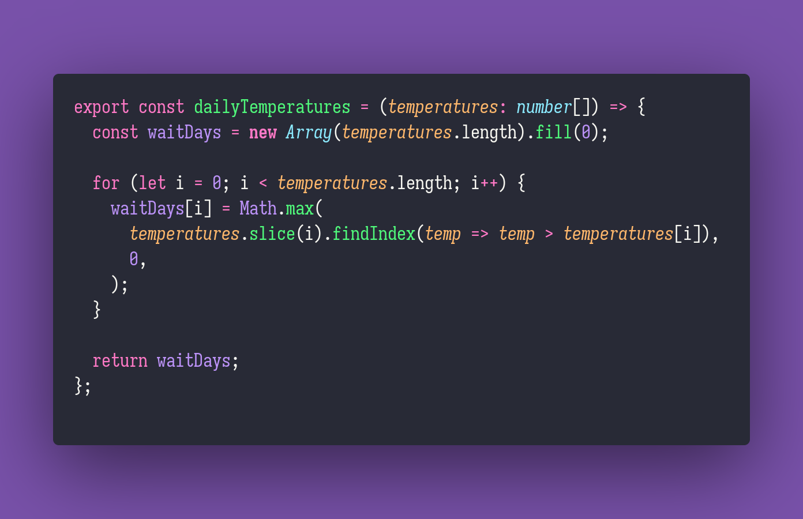

# 💥 Daily Temperatures

Interview question of the [issue #358 of rendezvous with cassidoo](https://buttondown.email/cassidoo/archive/dont-let-the-past-steal-your-present-cherrie/).

## The Question

Write a function that takes an array of daily temperatures and returns an array where each element
is the number of days you would have to wait until a warmer temperature.

If there is no future day for which this is possible, put 0 instead.

### Example

```js
> dailyTemperatures([70, 70, 70, 75])
> [3, 2, 1, 0]

> dailyTemperatures([90, 80, 70, 60])
> [0, 0, 0, 0]

> dailyTemperatures([73, 74, 75, 71, 69, 72, 76, 73])
> [1, 1, 4, 2, 1, 1, 0, 0]
```

## Solution


