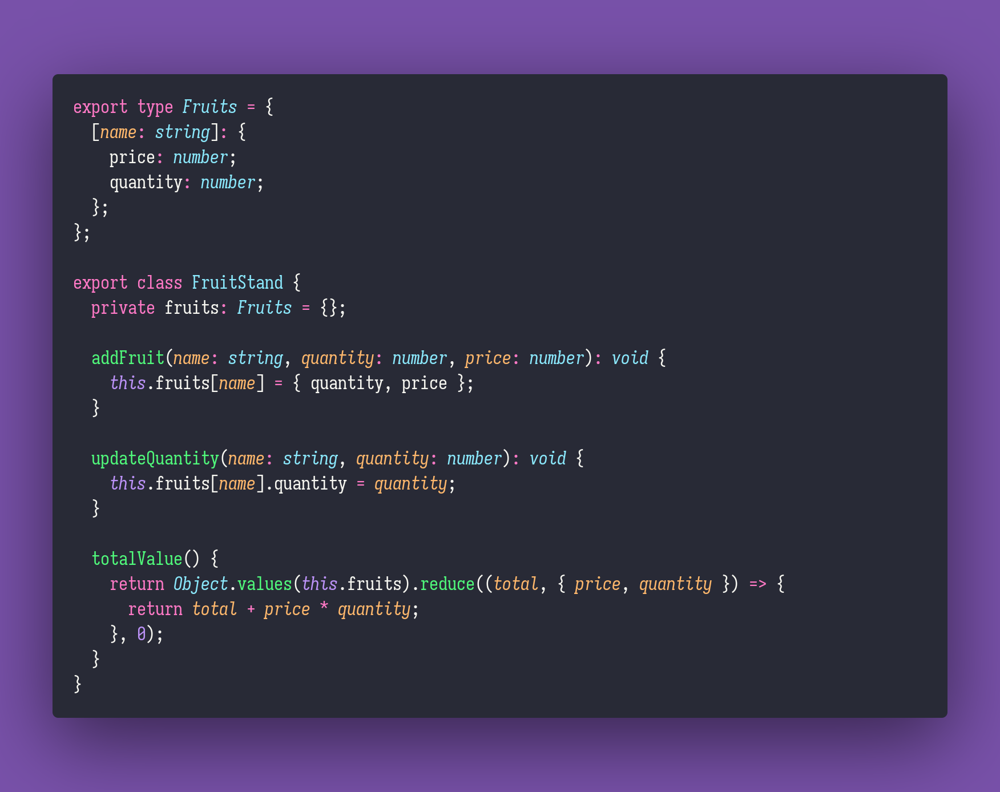

# 🎨 Fruit Stand

Interview question of the [issue #359 of rendezvous with cassidoo](https://buttondown.email/cassidoo/archive/the-days-you-work-are-the-best-days-georgia/).

## The Question

Define a `FruitStand` class that allows you to add different types of fruits with their quantities
and prices, update them, and calculate the total value of all the fruits in the stand.

Implement the following methods:

- `addFruit(name, quantity, price)`
- `updateQuantity(name, quantity)`
- `totalValue()!`

### Example

```js
// Create a new fruit stand
let stand = FruitStand()

// Add fruits to the stand
stand.addFruit("apple", 10, 0.5)
stand.addFruit("banana", 5, 0.2)
stand.addFruit("cherry", 20, 0.1)

// Update the quantity of an existing fruit
stand.updateQuantity("banana", 10)

// Calculate the total value of all fruits in the stand
console.log(stand.totalValue())
```

## Solution


