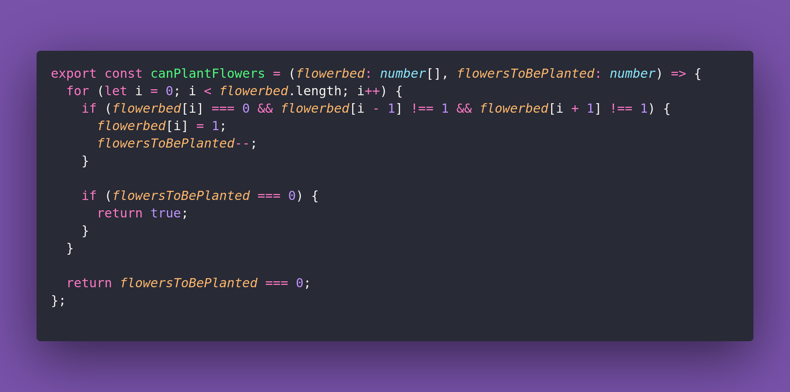

# *️⃣ Can Plant Flowers

Interview question of the [issue #360 of rendezvous with cassidoo](https://buttondown.email/cassidoo/archive/the-things-that-make-you-strange-are-the-things/).

## The Question

Write a function that takes an array of integers representing the number of flowers planted in a
line, and an integer k representing the number of additional flowers you want to plant.
Return whether it's possible to plant all k flowers without planting any two flowers adjacent to
each other.

### Example

```js
> canPlantFlowers([1, 0, 0, 0, 1], 1)
> true // you can plant 1 flower between the others

> canPlantFlowers([1, 0, 0, 0, 1], 2)
> false

> canPlantFlowers([0, 0, 0, 0, 0], 3)
> true

> canPlantFlowers([1, 0, 1, 0, 1], 1)
> false
```

## Solution


