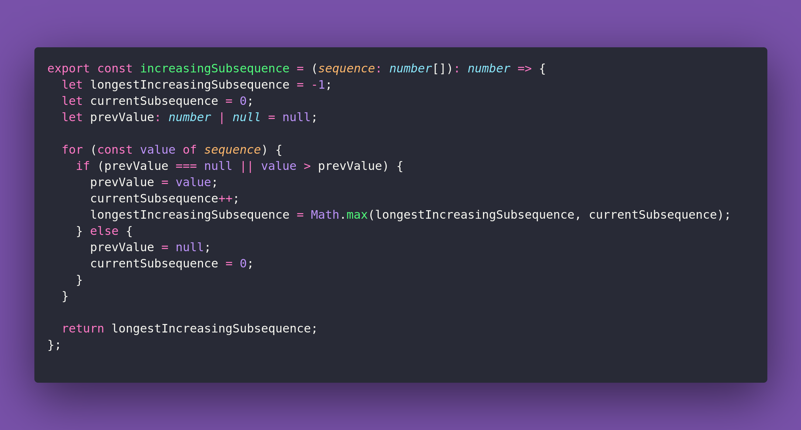

# 🎶 Increasing Subsequence

Interview question of the [issue #361 of rendezvous with cassidoo](https://buttondown.email/cassidoo/archive/creativity-takes-courage-henri-matisse/).

## The Question

Given an integer array nums, return the length of the longest increasing subsequence.

### Example

```js
> increasingSubsequence([10, 9, 2, 3, 7, 101, 18])
> 4

> increasingSubsequence([4, 4, 4, 4, 3])
> 1
```

## Solution


