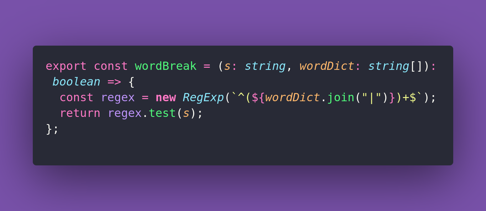

# 💙 Word Break

Interview question of the [issue #362 of rendezvous with cassidoo](https://buttondown.email/cassidoo/archive/you-are-only-as-beautiful-as-the-many-beautiful/).

## The Question

Given a string s and a dictionary of words dict, determine if s can be
segmented into a space-separated sequence of one or more dictionary words.

### Example

```js
> wordBreak("leetcode", ["leet", "code"])
> true

> wordBreak("catsandog", ["cat", "cats", "and", "sand", "dog"])
> false
// Although "cat", "cats", "and", and "dog" are in the dictionary, the string does not have a valid segmentation where all parts are in the dictionary.

> wordBreak("aaaaaaaa", ["aa", "aaa"])
> true
// "aaaaaaaa" can be segmented in multiple ways such as "aa aa aa aa" or "aaa aa aaa" where "aa" and "aaa" are in the dictionary.
```

## Solution


