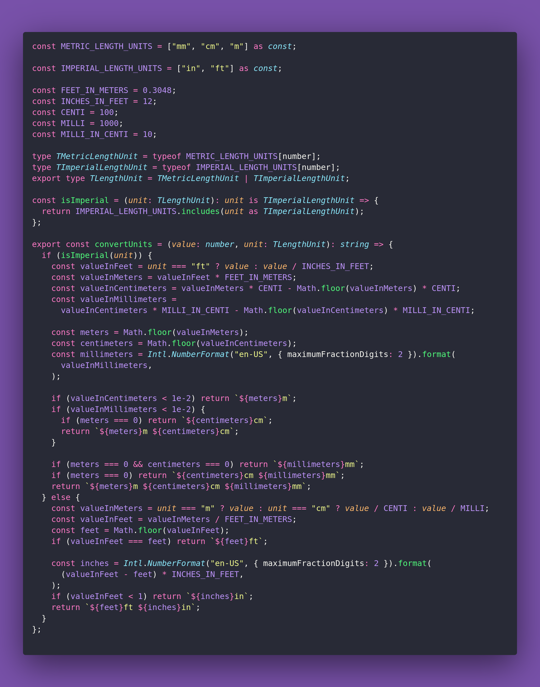

# 🌇 Convert Units

Interview question of the [issue #363 of rendezvous with cassidoo](https://buttondown.email/cassidoo/archive/you-waste-years-by-not-being-able-to-waste-hours/).

## The Question

Write a function that converts between metric
and imperial units. Break up the units into
millimeters, centimeters, and meters for
metric, and into inches and feet for imperial,
up to 2 decimal places.

### Example

```js
> convertUnits(7, "ft")
> "2m 13cm 3.6mm"

> convertUnits(44, "cm")
> "1ft 5.32in"
```

## Solution


