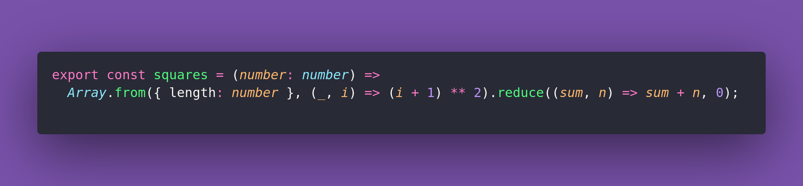

# ⬛ Squares

Interview question of the [issue #364 of rendezvous with cassidoo](https://buttondown.email/cassidoo/archive/fff/).

## The Question

Create a function that should take one argument n, which is a positive integer.
The function should return the sum of all squared positive integers between 1 and n, inclusive.

### Example

```js
> squares(5)
> 55
> squares(10)
> 385
> squares(25)
> 5525
> squares(100)
> 338350
```

## Solution


