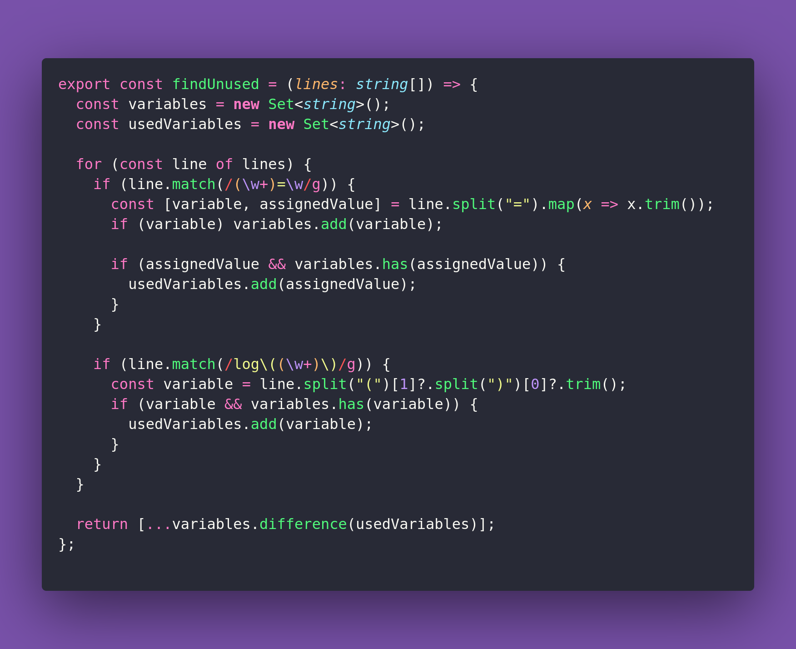

# 📺 Find Unused

Interview question of the [issue #365 of rendezvous with cassidoo](https://buttondown.email/cassidoo/archive/fff/).

## The Question

Given an array of logs and variable assignments, return a list of all unused variables.

### Example

```js
> findUnused(["a = 1", "b = a", "c = 2", "log(b)"]);
> ["c"]

> findUnused(["a = 1", "b = a", "c = 2", "log(c)"]);
> ["a", "b"]
```

## Solution


