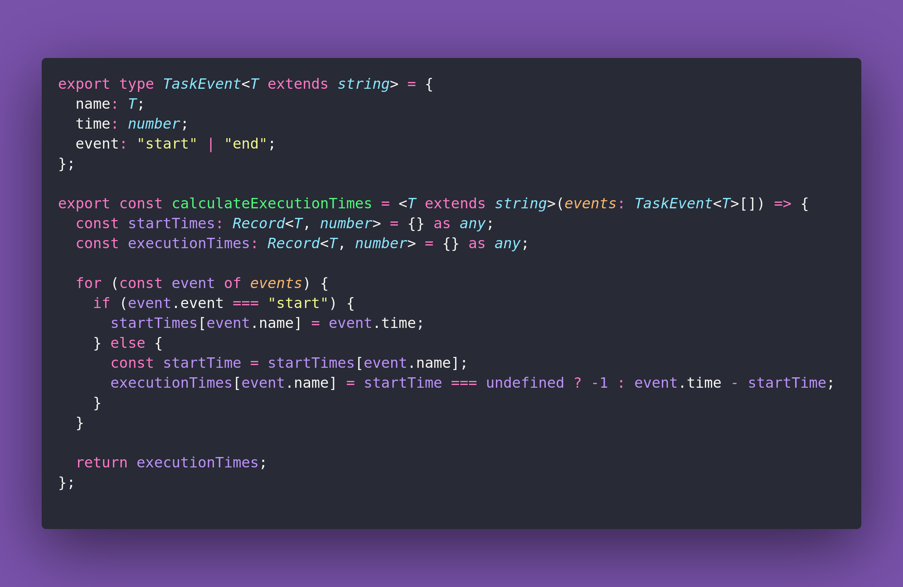

# 🏟️ Calculate Execution Times

Interview question of the [issue #366 of rendezvous with cassidoo](https://buttondown.com/cassidoo/archive/yesterdays-home-runs-dont-win-todays-games-babe/).

## The Question

Given an array of function logs, where each log consists of a function name, a timestamp, and an
event (either start or end), return the total execution time for each function.
The timestamp is an integer representing milliseconds since the start of the program.

### Example

```js
> calculateExecutionTimes([
    { name: "main", time: 0, event: "start" },
    { name: "subTask1", time: 5, event: "start" },
    { name: "subTask1", time: 10, event: "end" },
    { name: "subTask2", time: 15, event: "start" },
    { name: "subTask2", time: 20, event: "end" },
    { name: "main", time: 25, event: "end" }
])
> { main: 25, subTask1: 5, subTask2: 5 }
```

## Solution


