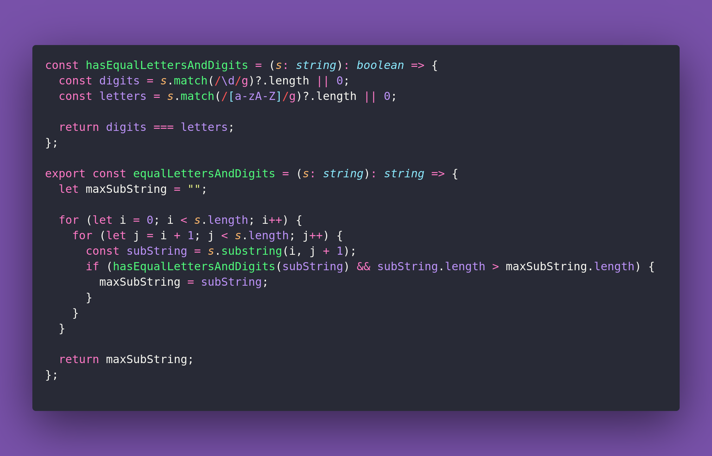

# 🧗Equal Letters And Digits

Interview question of the [issue #367 of rendezvous with cassidoo](https://buttondown.com/cassidoo/archive/you-cant-turn-back-the-clock-but-you-can-wind-it/).

## The Question

Given a string s containing letters and digits, return the longest
substring of s where the number of distinct letters is equal to the number
of distinct digits. If there are multiple substrings with the same length,
return the one that appears first.

### Example

```js
> equalLettersAndDigits("abc12345")
> "abc123"

> equalLettersAndDigits("a1")
> "a1"

> equalLettersAndDigits("a12bc34")
> "a12bc3"
```

## Solution


