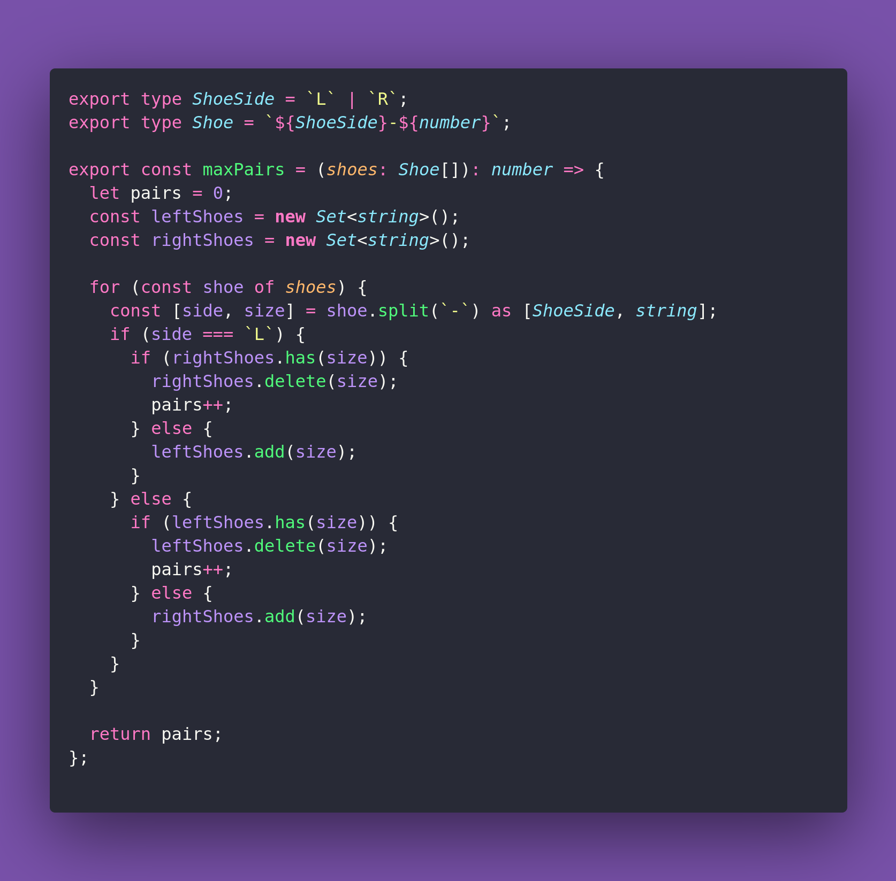

# 👟 Equal Letters And Digits

Interview question of the [issue #368 of rendezvous with cassidoo](https://buttondown.com/cassidoo/archive/to-lead-people-walk-behind-them-lao-tzu/).

## The Question

You are given an array of strings representing a collection of shoes. Each shoe is labeled with its
type ("L" for left or "R" for right) and its size. Determine the maximum number of matching pairs
of shoes that can be formed.

### Example

```js
> maxPairs(["L-10", "R-10", "L-11", "R-10", "L-10", "R-11"])
> 3

> maxPairs(["L-10", "L-11", "L-12", "L-13"])
> 0

> maxPairs(["L-8", "L-8", "L-8", "R-8"])
> 1
```

## Solution


