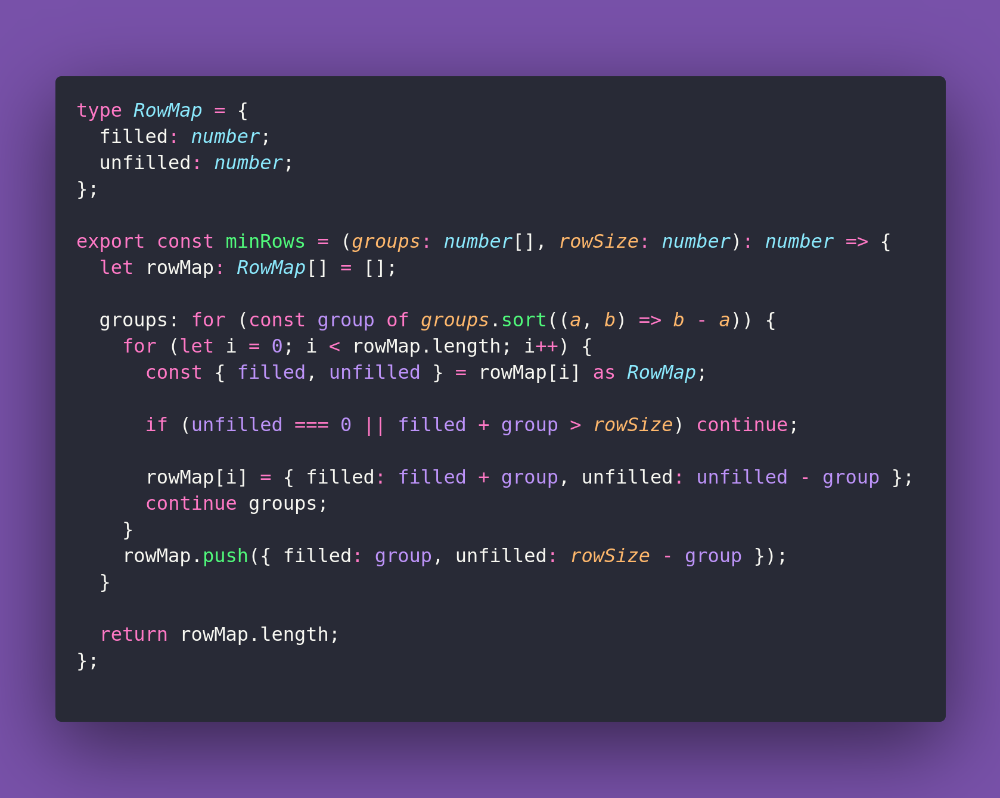

# 💗 Min Rows

Interview question of the [issue #369 of rendezvous with cassidoo](https://buttondown.com/cassidoo/archive/never-give-up-on-your-dreams-no-matter-how/).

## The Question

You are given an array of people represented by integers, where each number corresponds to the
number of people in a group. Determine the minimum number of rows required to seat everyone
such that no group is split across different rows. You can assume no group will be larger than
a given row size!

### Example

```js
let rowSize = 10

> minRows([4, 8, 3, 5, 6], rowSize)
> 3

> minRows([4, 5, 4, 3, 3], rowSize)
> 2

> minRows([7, 7, 8, 9, 6], rowSize)
> 5
```

## Solution


