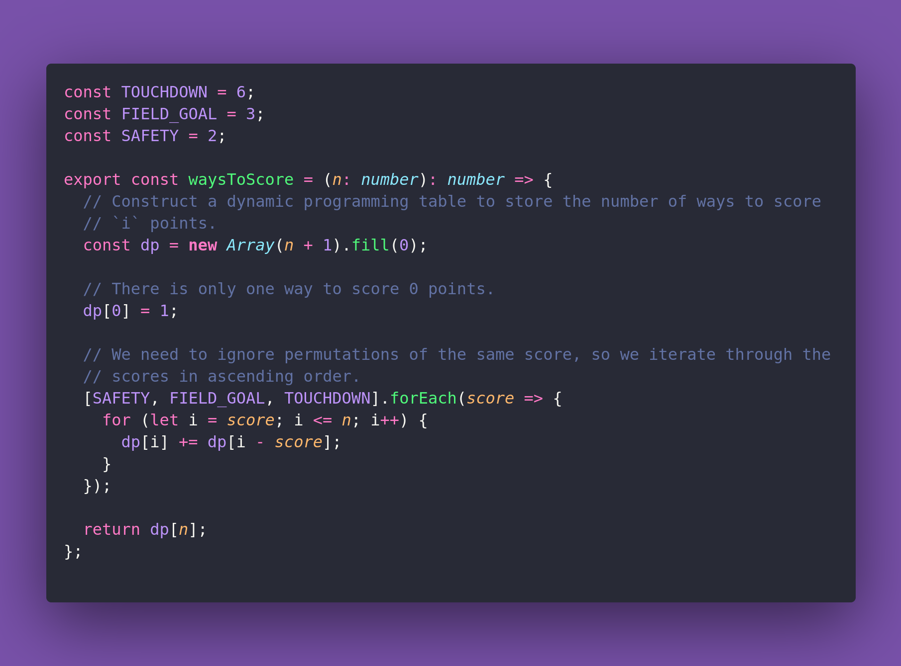

# 🏈 Ways to Score

Interview question of the [issue #370 of rendezvous with cassidoo](https://buttondown.com/cassidoo/archive/no-matter-what-happens-in-life-be-good-to-people/).

## The Question

You are given an integer n representing the total points a team wants to score in an American
football game. You need to determine the number of unique ways the team can achieve exactly n
points using any combination of touchdowns (6 points), field goals (3 points), or safeties
(2 points).

### Example

```js
> waysToScore(5)
> 1

> waysToScore(12)
> 6

> waysToScore(6)
> 3
```

## Solution


