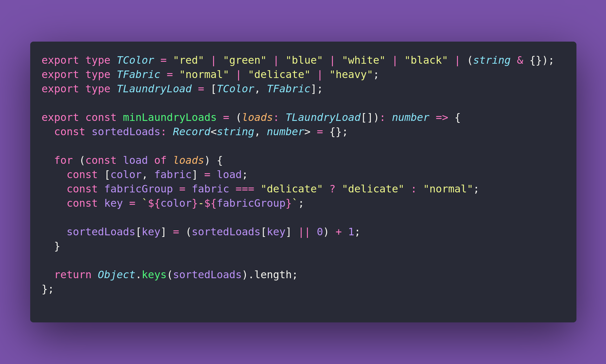

# 🧺 Minimum Laundry Loads

Interview question of the [issue #371 of rendezvous with cassidoo](https://buttondown.com/cassidoo/archive/show-me-your-friends-and-ill-show-you-your-future/).

## The Question

You're designing a smart laundry sorting system. You have a list of clothing items, each
with a color and a fabric type. Sort these items into the minimum number of loads n and
return n, where items of the same color can be washed together, and some different
fabric types cannot be mixed together. "Normal" fabric types can be mixed with "heavy",
but "delicate" cannot be mixed with anything.

### Example

```js
let load1 = [
  ["red", "normal"],
  ["blue", "normal"],
  ["red", "delicate"],
  ["blue", "heavy"]
]

let load2 = [
  ["white", "normal"],
  ["white", "delicate"],
  ["white", "normal"],
  ["white", "heavy"]
]

> minLaundryLoads(load1)
> 3 // one delicate red, one normal red, and one with the blues

> minLaundryLoads(load2)
> 2 // one delicate white, one with everything else
```

## Solution


