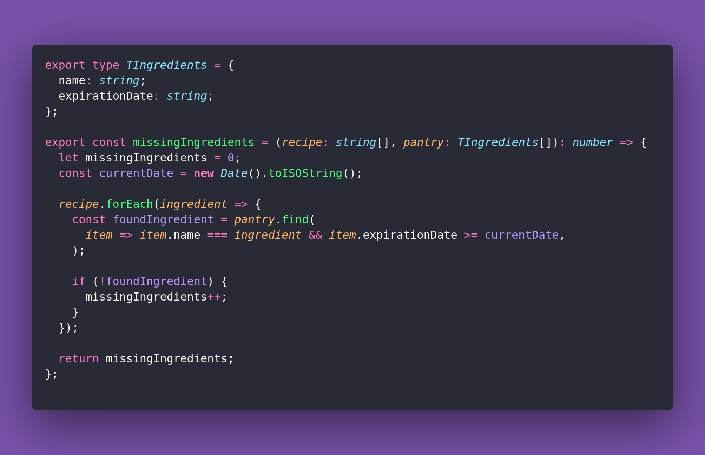

# 🎸 Missing Ingredients

Interview question of the [issue #373 of rendezvous with cassidoo](https://buttondown.com/cassidoo/archive/its-very-easy-to-be-judgmental-until-you-know/).

## The Question

Given a list of ingredients needed for a recipe, represented as strings, and a list of
ingredients you have in your pantry, write a function to return the minimum number of
additional ingredients you need to buy to make the recipe. If you want to do some extra credit,
add expiration dates to the pantry items, and only account for food that isn't expired.

### Example

```js
Input:
recipe = ["eggs", "flour", "sugar", "butter"]
pantry = ["sugar", "butter", "milk"]

Output:
2
```

## Solution


