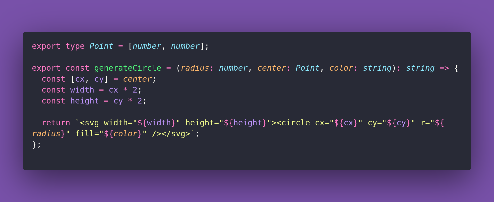

# 🖍️ Get RSS

Interview question of the [issue #375 of rendezvous with cassidoo](https://buttondown.com/cassidoo/archive/whatever-the-problem-be-part-of-the-solution-tina/).

## The Question

Write a function that takes in an RSS feed URL, and returns the title of and link to the the
original feed source. You can get other things too, if you'd like!

### Example

```js
getRSS('https://cassidoo.co/rss.xml')
"Cassidy Williams, https://cassidoo.co/"

getRSS("https://feed.syntax.fm/")
"Syntax - Tasty Web Development Treats, https://syntax.fm"
```

## Solution


