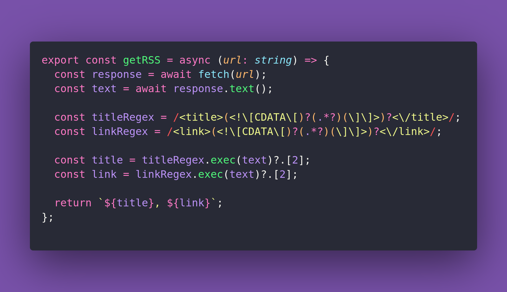

# 🌽 Generate Circle

Interview question of the [issue #374 of rendezvous with cassidoo](https://buttondown.com/cassidoo/archive/dont-block-your-blessings-jennifer-hudson/).

## The Question

Write a function that generates a valid SVG string for a circle given its radius, center
position, and color.

### Example

```js
generateCircle(radius = 50, center = (100, 100), color = "blue")
"<svg width='200' height='200'><circle cx='100' cy='100' r='50' fill='blue'/>svg>"

generateCircle(radius = 30, center = (75, 50), color = "red")
"<svg width='150' height='100'><circle cx='75' cy='50' r='30' fill='red'/>svg>"
```

## Solution


