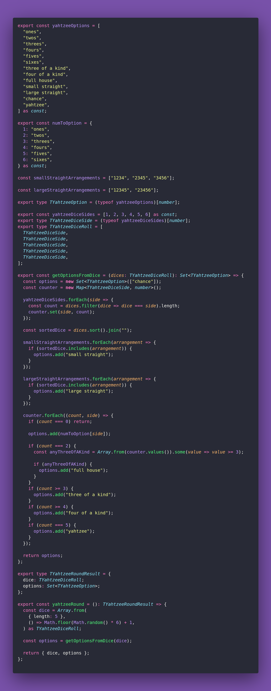

# 🐙 Yahtzee Round

Interview question of the [issue #376 of rendezvous with cassidoo](https://buttondown.com/cassidoo/archive/instead-of-saying-i-can-do-it-it-is-better-to/).

## The Question

Implement a round of the game [Yahtzee](https://en.m.wikipedia.org/wiki/Yahtzee?utm_source=cassidoo&utm_medium=email&utm_campaign=instead-of-saying-i-can-do-it-it-is-better-to), where 5 dice are randomly
rolled, and the function returns what options the user has to score more than 0 points.

Extra credit: implement all 13 rounds!

### Example

```js
yahtzeeRound()
> { dice: [2,2,3,3,3],
    options: ["twos","threes","full house","three of a kind","chance"]
  }

yahtzeeRound()
> { dice: [2,3,4,2,2],
    options: ["twos","threes","fours","three of a kind","chance"]
  }

yahtzeeRound()
> { dice: [4,3,6,3,5],
    options: ["threes","fours","fives","sixes","small straight","chance"]
  }
```

## Solution


