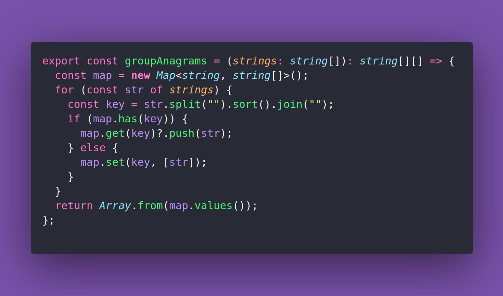

# 🟨 Group Anagrams

Interview question of the [issue #377 of rendezvous with cassidoo](https://buttondown.com/cassidoo/archive/simplicity-is-the-ultimate-sophistication/).

## The Question

Given an array of strings, group the anagrams together.

### Example

```js
groupAnagrams(["eat", "tea", "tan", "ate", "nat", "bat"])
[["eat","tea","ate"],["tan","nat"],["bat"]]

groupAnagrams(["vote", "please"])
[["vote"],["please"]]

groupAnagrams(["debitcard", "badcredit"])
[["debitcard", "badcredit"]]
```

## Solution


