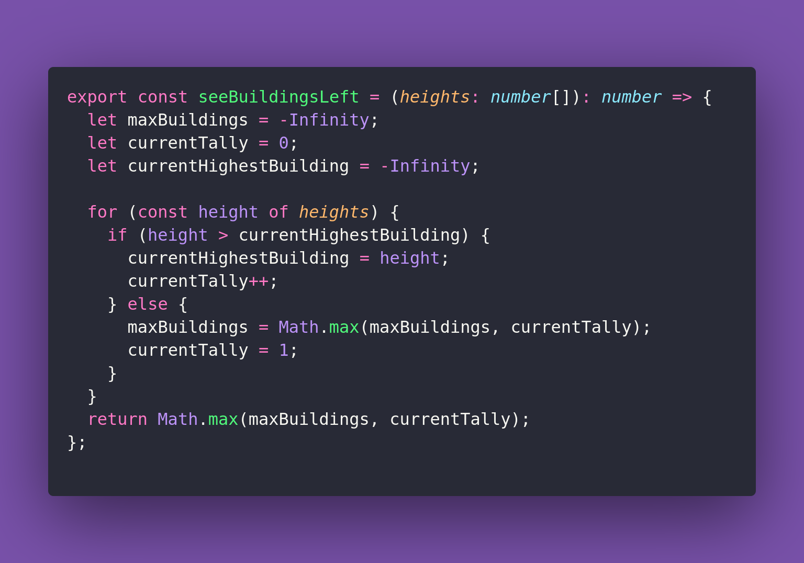

# 🍁 See Buildings Left

Interview question of the [issue #378 of rendezvous with cassidoo](https://buttondown.com/cassidoo/subscribers/fc81c7a7-33f0-4542-b71e-51d2d8cf909c/archive/stand-for-something-or-you-will-fall-for-anything).

## The Question

Given a list of integers representing the heights of buildings, return the maximum number of
buildings that can be seen when looking from the left. A building can see another building if
it is taller than all the buildings to its left. The height of the tallest building is included
in the count.

### Example

```js
seeBuildingsLeft([1,2,3,4,5])
5

seeBuildingsLeft([5,4,3,2,1])
1

seeBuildingsLeft([3,7,8,3,6,1])
3
```

## Solution


