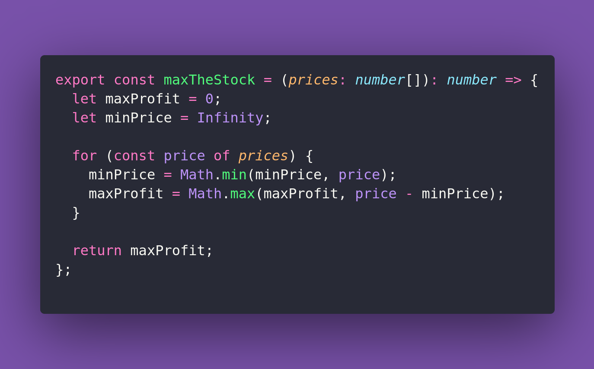

# 📈 Max The Stock

Interview question of the [issue #379 of rendezvous with cassidoo](https://buttondown.com/cassidoo/archive/you-may-delay-but-time-will-not-benjamin-franklin/).

## The Question

Given an array of integers representing the stock prices of a company in
chronological order, write a function that determines the maximum profit you can
achieve by buying and selling the stock once. If no profit can be made, return 0.

### Example

```js
> maxTheStock([7, 1, 5, 3, 6, 4])
> 5 // (buy at 1, sell at 6)

> maxTheStock([7, 6, 4, 3, 1])
> 0 // (no profit possible)
```

## Solution


