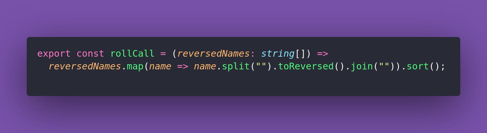

# 🛼 Roll Call

Interview question of the [issue #381 of rendezvous with cassidoo](https://buttondown.com/cassidoo/archive/how-beautiful-it-is-to-get-up-and-go-do-something/).

## The Question

Santa is conducting his daily roll call for the reindeer, but the printer has mistakenly printed
all their names backwards. To take attendance properly, he urgently needs a tool to reverse the
reindeer names and put them in alphabetical order! Can you help Santa?

### Example

```js
rollCall(["yzneT","ydissaC","enimA"])
["Amine","Cassidy","Tenzy"]

rollCall(["rennuD","nexiV","recnarP","temoC","neztilB","recnaD","diduC","rehsaD","hploduR"])
["Blitzen","Comet","Cupid","Dancer","Dasher","Donner","Prancer","Rudolph","Vixen"]

rollCall(["A","B","C"])
["A","B","C"]
```

## Solution


