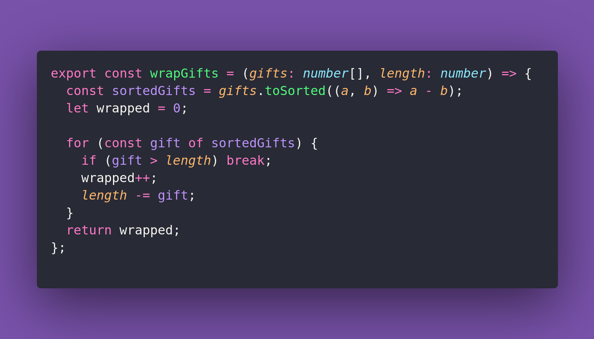

# 🎁 Wrap Gift

Interview question of the [issue #382 of rendezvous with cassidoo](https://buttondown.com/cassidoo/archive/most-of-the-trouble-in-the-world-is-caused-by/).

## The Question

Write a function wrapGifts that finds the maximum number of gifts that can be wrapped using a
single strip of wrapping paper of a given width.
Each gift has a specific length, and you can only wrap gifts if their total length fits within the
paper width without cutting the paper.

### Example

```js
wrapGifts([2, 3, 4, 5], 7)
2 // either gifts 2 and 5, or 3 and 4.

wrapGifts([1, 1, 1, 1, 1, 1, 1], 3)
3

wrapGifts([1, 2, 3, 4, 5], 6)
3 // 1 and 2 and 3
```

## Solution


