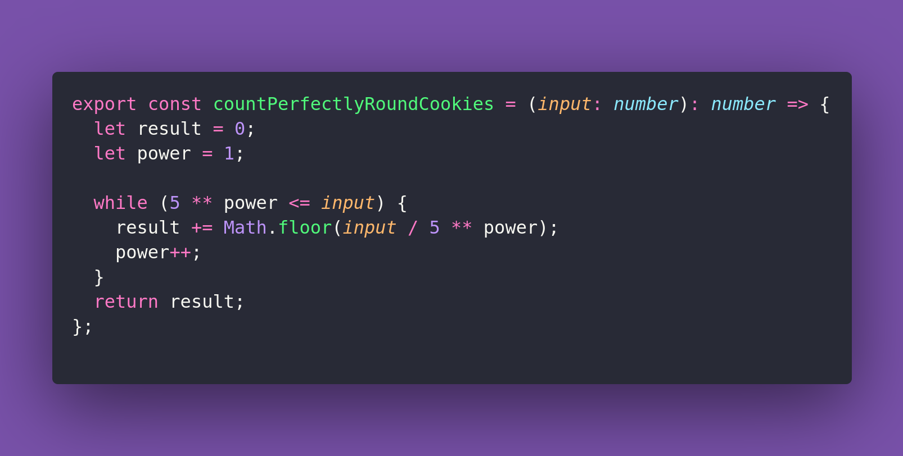

# 🍪 Count Perfectly Round Cookies

Interview question of the [issue #384 of rendezvous with cassidoo](https://buttondown.com/cassidoo/archive/the-future-belongs-to-those-who-believe-in-the/).

## The Question

At the Magic Cookie Factory, cookies are baked in factorial quantities.
A cookie is "perfectly round" if its size ends with a zero.
Write a function to determine how many perfectly round cookies will be made when baking with
`n!` ingredients.

### Example

```js
countPerfectlyRoundCookies(5)
1 // 5! = 120, which has 1 trailing zero

countPerfectlyRoundCookies(10)
2 // 10! has 2 trailing zeros

countPerfectlyRoundCookies(100)
24
```

## Solution


