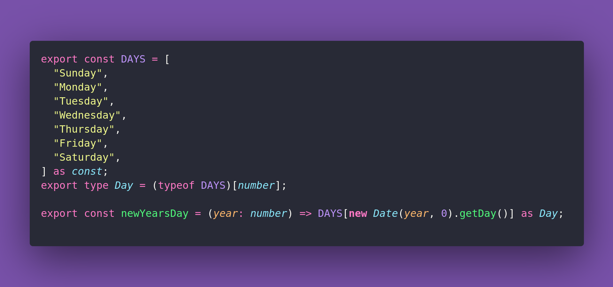

# 🌷 New Years Day

Interview question of the [issue #385 of rendezvous with cassidoo](https://buttondown.com/cassidoo/archive/we-must-adjust-to-changing-times-and-still-hold/).

## The Question

Given a year, return the day of the week for New
Year's Day of that year.

### Example

```js
> newYearsDay(2025)
> "Wednesday"

> newYearsDay(2024)
> "Monday"
```

## Solution


